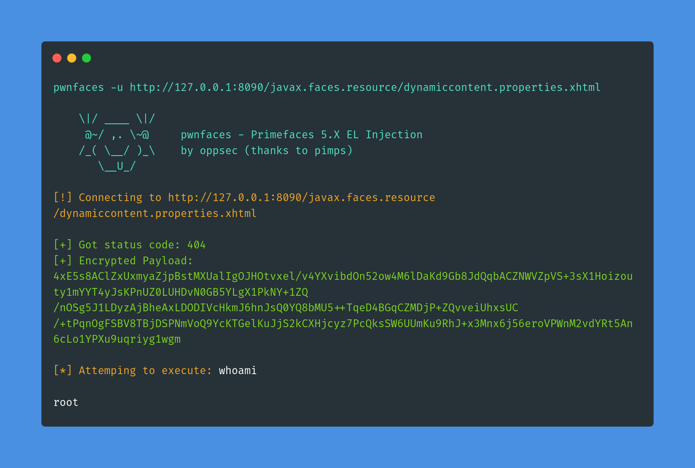

# 😛 Faces
> Primefaces 5.X 

<div align="center">
     
</div>

<br>

<p align="center">
     
     
     
     
     
</p>

___

<br>

### 🕵️ O que é pwnfaces?
🕵️ **pwnfaces** é uma ferramenta Golang criada para explorar a vulnerabilidade definida como CVE-2017-1000486 (EL Injection no PrimeFaces 5.X) para fins de BUGBOUNTY

<br>

### ⚡ Instalando / Iniciando

Um guia rápido de como instalar e usar o pwnfaces.

```concha
1. vá instalar github.com/oppsec/pwnfaces
2. pwnfaces -u http://127.0.0.1:8090/javax.faces.resource/dynamiccontent.properties.xhtml
```

Você pode usar `go install github.com/oppsec/pwnfaces@latest` para atualizar a ferramenta

<br><br>

### ⚙️ Pré-requisitos
- [Golang](https://go.dev/dl/) instalado em sua máquina.

<br><br>

### ✨ Características
- Extremamente rápido
- Baixo uso de RAM e CPU
- Feito em Golang

<br><br>

### 🔨 Contribuindo

Um guia rápido de como contribuir com o projeto.

```concha
1. Crie uma bifurcação do repositório pwnfaces.
2. Baixe o projeto git 
3. cd pwnfaces/
4. Faça suas alterações.
5. Confirme e faça um git push.
6. Abra uma solicitação pull.
```

<br><br>

### ⚠️ Aviso
- Isso é para fins de estudo e bugbounty
